# TxtMiruOnTheWebServer
TxtMiruOnTheWeb用のServer構築

## 概要

自分のGoogleアカウントにサーバーを構築することで、  
Googleドライブ上に保管した小説を「TxtMiru on the Web」で閲覧できるようになります。

## Google

### 手順

1. Google スプレッドシートのコピー

	----
	以下のURLをクリック

	「[Google スプレッドシート](https://docs.google.com/spreadsheets/d/14WIjXgO9YQFTg_vwEumPLNJCrMp90IPFfQ-eYvSKnQE/copy)」

	----

	コピーの画面が表示されるので、「コピーを作成」をクリックして、自分のGoogleアカウントにスプレッドシートをコピー

	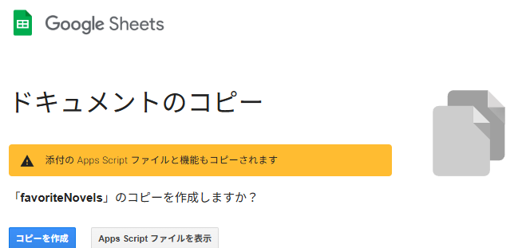  

	
	---

	コピー完了

	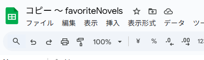

2. 名前の変更 ※任意

	ファイル名が「コピー ～ favoriteNovels」となっているので
	Google ドライブで起動してコピーしたファイルの名前を変更

	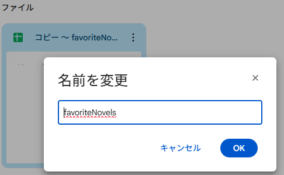

3. フォルダを作成してファイルを移動 ※任意

	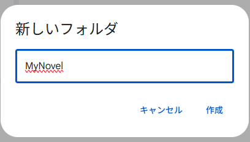

4. デプロイ

	ブラウザから[https://script.google.com/home](https://script.google.com/home)を開く

	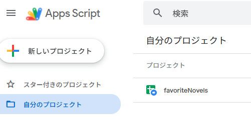

	---

	コピーしたプロジェクト「favoriteNovels」ダブルクリックし右上の「デプロイ」クリック

	

	---
	
	「新しいデプロイ」をクリック

	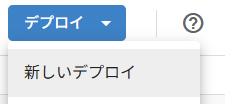

	---

	説明：任意  
	ウェブアプリ：自分  
	アクセスできるユーザー：全員  
	右下の「デプロイ」をクリック

	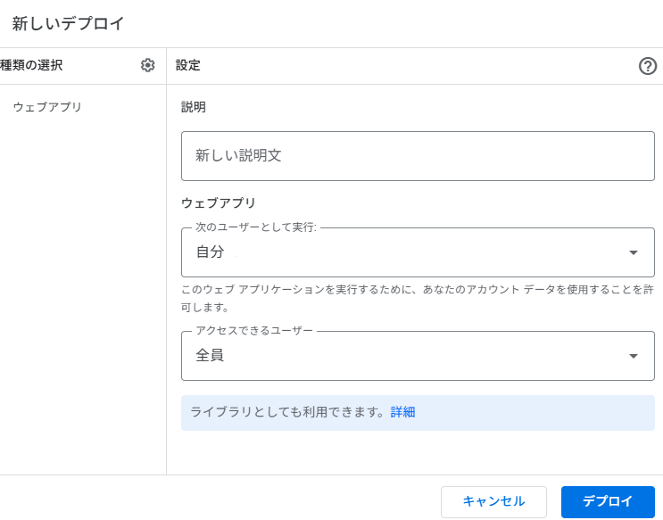

	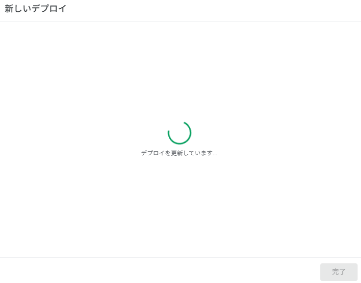

	---

	「アクセスを承認」をクリック

	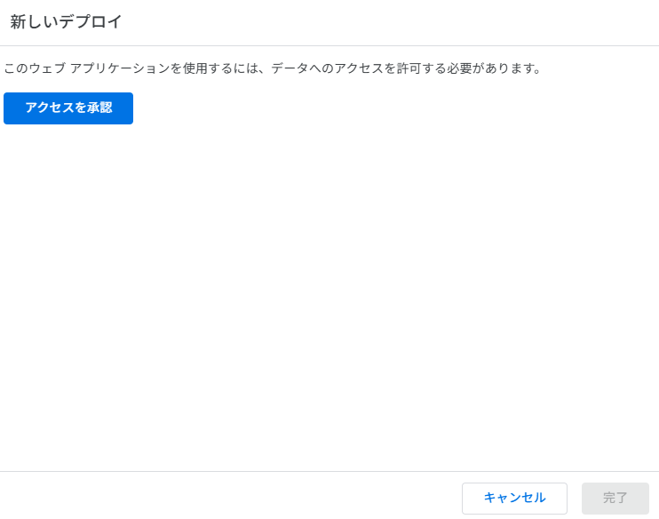

	---

	アカウントを選択

	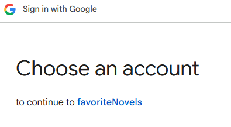

	---

	警告が表示されるので「Advanced」をクリック

	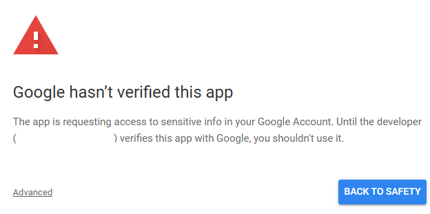

	---

	「Go to favoriteNovels (unsafe)」をクリック

	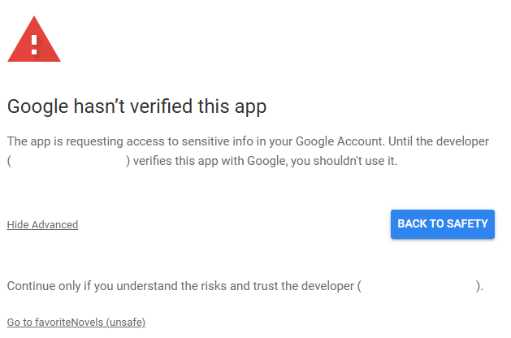

	---

	「Allow」をクリック

	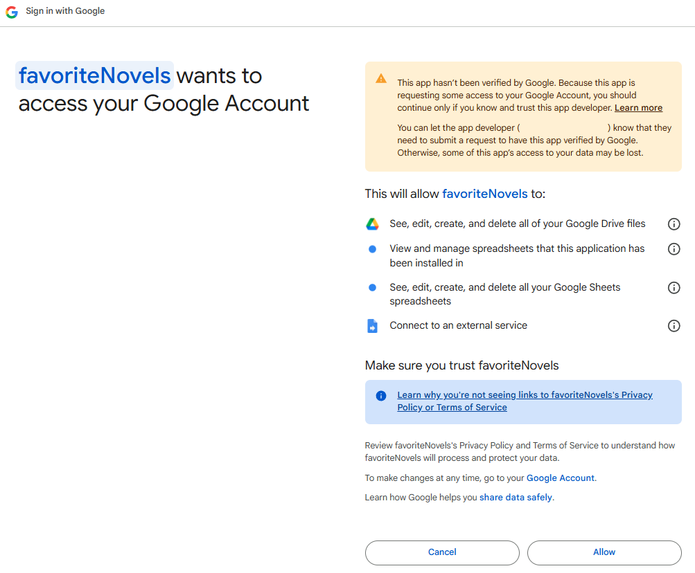

	---

	「デプロイを更新しました。」と表示されればデプロイは完了です。

	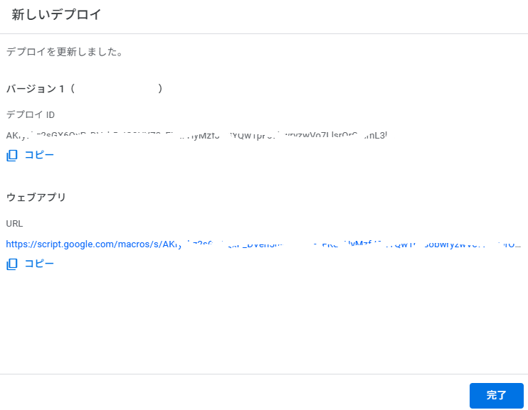

	---

	ウェブアプリのURLをコピーしてサイトを表示
	以下の画面が表示され問題ないことを確認します。

	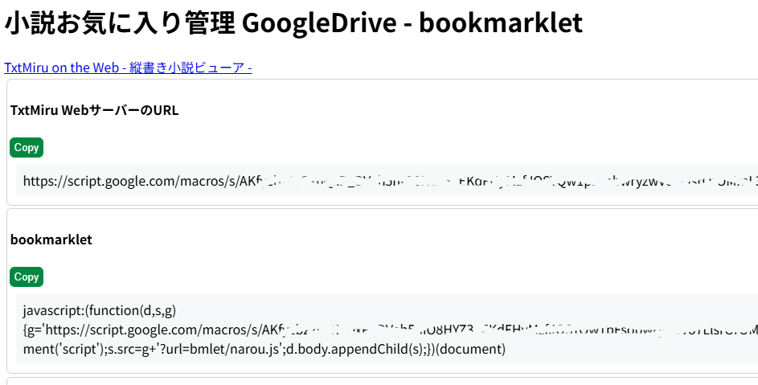

5. Bookmarkletのコピー

	[https://github.com/gearsns/TxtMiruOnTheWebServer/source/Bookmarklet/narou.js](https://github.com/gearsns/TxtMiruOnTheWebServer/source/Bookmarklet/narou.js)
	からnarou.jsをダウンロード

	---

	Googleドライブ上のBookmarkletフォルダにダウンロードしたファイルを保存

	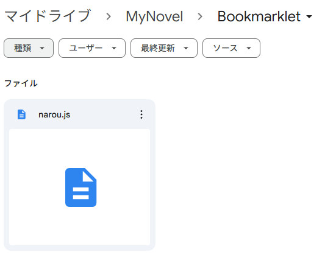

6. TxtMiru on the Webの設定

	「4.」のデプロイで表示したサイト上で「TxtMiru WebサーバーのURL」をコピー

	---

	[TxtMiru on the Web](https://gearsns.github.io/TxtMiruOnTheWeb/index.html)の「設定」をクリック

	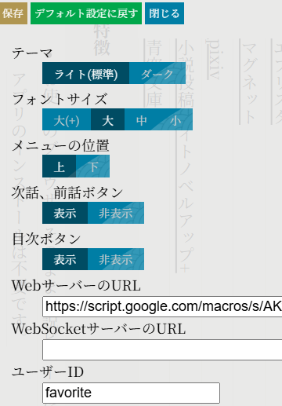

	WebサーバーのURLに「TxtMiru WebサーバーのURL」を入力  
	ユーザーIDに任意の値(「favorite」など)を入力  

## 小説の保管

### Bookmaklet

デプロイしたサイトの表示に従ってbookmarkletを設定し小説をGoogleドライブ上保管してください。

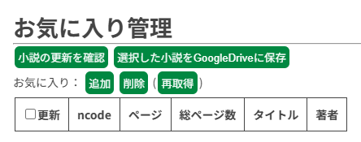

### narou.rb

narou.rbで取得した小説の保管

小説データ / 小説家になろう / nXXXXXフォルダを作成

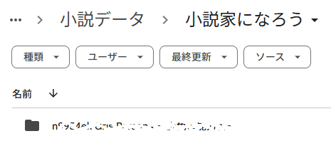

作成したフォルダに
toc.yamlファイル/rawフォルダをコピーします。

favoriteNovelsシートに小説を追加します。

id : 1から連番  
url : https://ncode.syosetu.com/nxxxx  
maxPage : toc.yamlやrawフォルダ内のファイル数で確認  
source : GoogleDrive  
